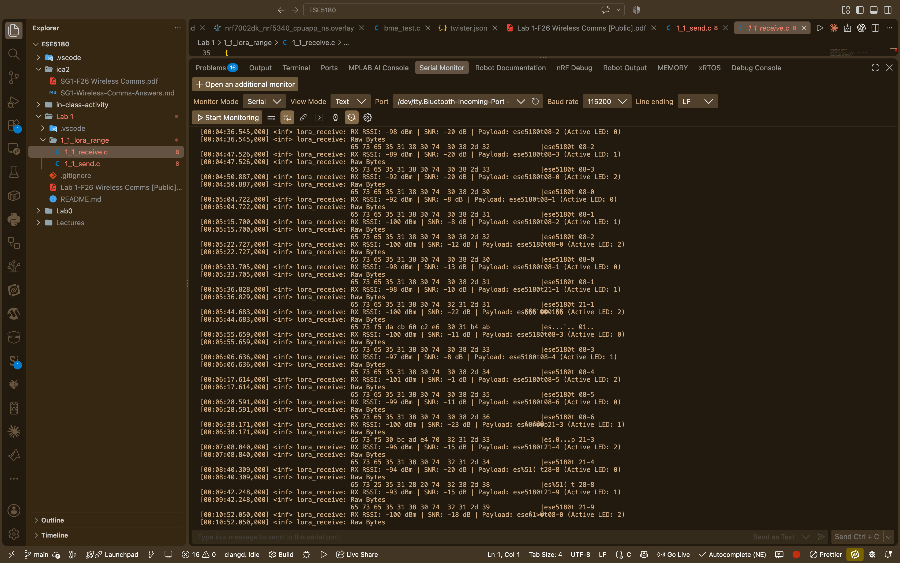
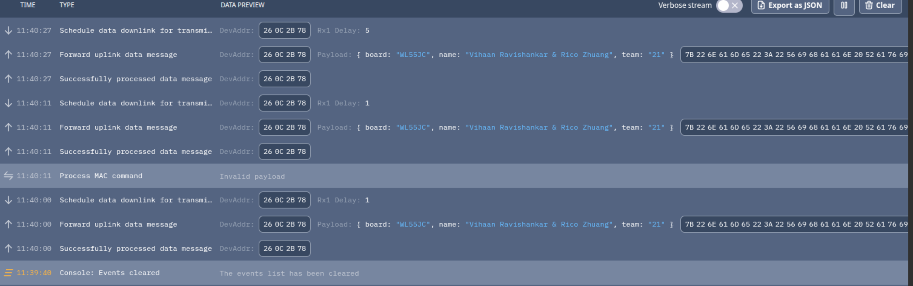
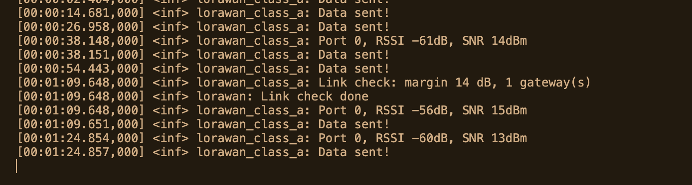

# ESE5180: Lab 1 Wireless Comms

**Group Number:** 21

| Team Member Name   | Email Address |
| ------------------ | ------------- |
| Vihaan Ravishankar |      vihaan1@engineering.upenn.edu         |
| Rico Zhuang           | zzhuan13@engineering.upenn.edu     |

**GitHub Repository URL:** https://github.com/ese5180/f26-lab1-t21

## 1

### 1.1 LoRa Range Challenge

Code is in `1_1_lora_range/` as `1_1_send.c` and `1_1_receive.c`.

Longest distance packet:

```
RSSI: -93 dBm
SNR: -15 dB
Distance: 450m
```



### 1.2 Trading Range for Bandwidth

Code is in `1_2_lora_bandwidth/` as `1_2_send.c` and `1_2_receive.c`.

Fastest transmission speed: about 26.7 kbps on air (12 byte packet in 3.6 ms),
up from about 97 bps in 1.1 (991 ms).

Parameters changed from 1.1:

- Spreading factor SF12 to SF5
- Bandwidth 125 kHz to 500 kHz
- Preamble 8 to 12 symbols (the radio's minimum at SF5)
- Payload CRC turned back on (only adds 0.3 ms at this setting)

Frequency, coding rate 4/5, payload, and `tx_power = -10` are unchanged. The
shorter airtime also means about 275x less transmit energy per packet.

## 2

### 2.1 LoRaWAN

Code is in `2_lorawan/`. Keys go in `2_lorawan/src/secrets.h`, which is gitignored.

### 2.2




